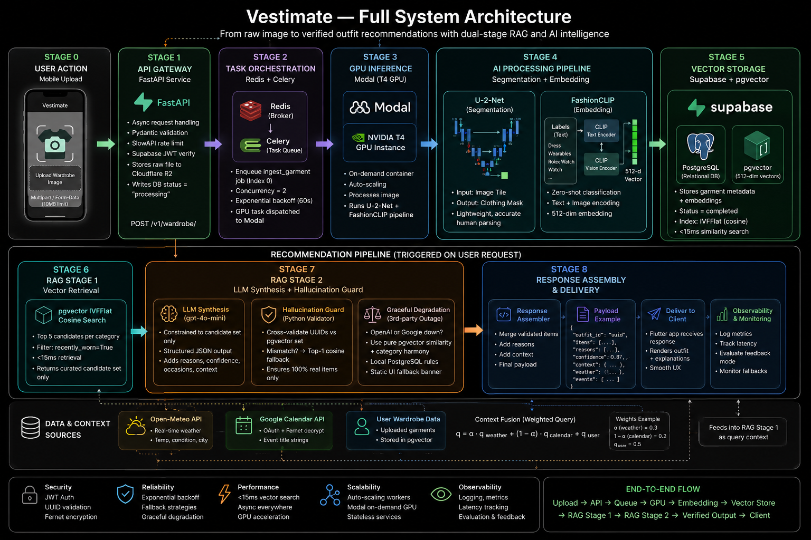
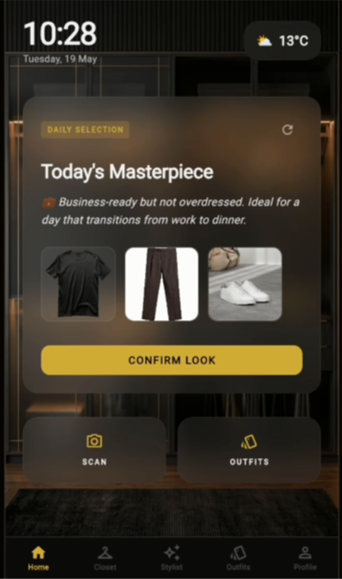
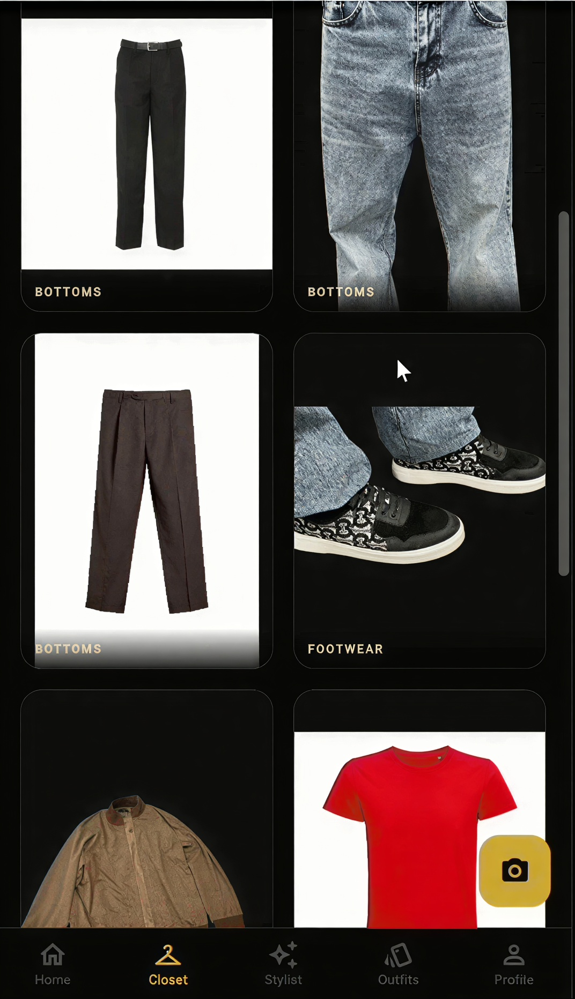
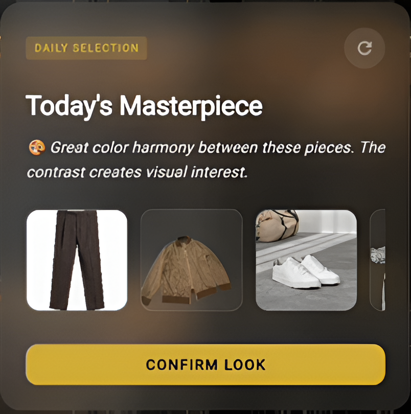
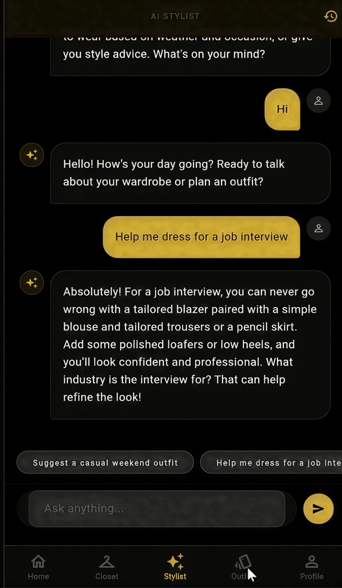

<div align="center">

# VESTIMATE

**AI-powered wardrobe intelligence. Context-aware. Vector-native. Production-oriented.**

[](https://fastapi.tiangolo.com)
[](https://flutter.dev)
[](https://supabase.com)
[](https://modal.com)
[](https://redis.io)
[](LICENSE)
[]()
[]()

---

*Vestimate transforms a user's physical wardrobe into a 512-dimensional semantic vector space — then uses it to synthesize personalized, context-aware outfit recommendations by reasoning simultaneously over real-time weather, calendar events, and personal style history.*

---



> *Full system flow: Flutter upload → FastAPI gateway → Redis broker → Celery worker → Modal T4 GPU → U-2-Net + FashionCLIP → Supabase pgvector → dual-stage RAG → verified outfit output*

</div>

---

## Visual Product Showcase

<div align="center">

| Home & Daily Recommendation | Wardrobe Grid | AI Outfit Collections |
|:---:|:---:|:---:|
|  |  |  |

</div>

**Stylist Chat Interface:**



---

## What Vestimate Is

Vestimate is a cross-platform mobile application and distributed AI backend that treats a user's wardrobe not as a static list of items, but as a structured, queryable, semantically-indexed dataset.

When a user photographs a garment, it enters an ingestion pipeline: background is removed by a U-2-Net segmentation model, and the isolated garment is projected into a 512-dimensional joint vision-language embedding space by FashionCLIP. That vector — along with zero-shot-classified metadata — is persisted in a pgvector-enabled PostgreSQL database. The garment is now semantically addressable.

At recommendation time, the system pulls live weather from Open-Meteo, decrypts the user's Google Calendar context via Fernet-secured OAuth, constructs a composite query vector, and runs a sub-15ms IVFFlat cosine similarity search across the wardrobe. The top candidates — and only those — are passed to a constrained LLM synthesis layer that generates a structured outfit with a natural-language stylist note. A Python hallucination guard cross-validates every item UUID before anything reaches the client.

The entire infrastructure runs at under $80/month using a scale-to-zero serverless GPU architecture. This is not a demo. It is a production-oriented system engineered under real resource constraints.

---

## Why This Exists

The fashion e-commerce industry operates with a structural data problem disguised as a UX problem.

Return rates in online fashion average 30–40% across major markets. The primary driver is not defective products — it is purchase decisions made without adequate fit, style, or context information. The market's existing responses — static size tables, AR texture overlays, and rule-based recommendation engines built on `if-else` trees — share a common failure: they are architecturally incapable of reasoning.

A rule-based system can suggest boots when it's raining. It cannot differentiate between formal Chelsea boots appropriate for a client meeting and rubber wellingtons appropriate for a hike — using only an unstructured calendar event string as input. That distinction requires a system that understands the semantic geometry of language and maps it into the same representational space as the garments themselves.

Vestimate is an attempt to build the right architectural foundation for that problem.

---

## Core Features

**Wardrobe Digitization**
Native Flutter camera integration with multipart upload. Raw images are immediately enqueued for asynchronous GPU processing. The UI never blocks.

**AI Segmentation & Embedding**
U-2-Net salient object detection removes backgrounds from garment photographs. FashionCLIP (ViT-B/16, trained on 2.5M+ fashion image-text pairs) encodes the isolated garment into a 512-dimension semantic vector. Zero-shot cosine classification extracts category, material, fit, and 32 chromatic anchors — no custom classification heads required.

**Contextual Outfit Recommendation**
Daily recommendations synthesize three data streams: real-time weather (Open-Meteo API), calendar event context (Google Calendar OAuth), and the user's indexed wardrobe. These are combined into a composite query vector and resolved against the wardrobe using pgvector IVFFlat cosine similarity search.

**Dual-Stage RAG Architecture**
Stage 1 is pure vector mathematics — deterministic, fast, hallucination-free candidate retrieval. Stage 2 is constrained LLM synthesis: gpt-4o-mini receives only the pre-validated candidate set and returns a structured JSON outfit configuration. A Python interceptor validates every item UUID before the payload reaches the Flutter client.

**ML Confidence Gate**
Items that fall below a 0.70 confidence threshold on zero-shot classification are accepted into the wardrobe without friction, but flagged `needs_review=True` and enqueued in a `manual_review_queue` table. The vector store is never corrupted by low-confidence data.

**Graceful Degradation**
If OpenAI or Google Calendar are unreachable, the system falls back to a pure pgvector color-harmony and category-match algorithm running entirely within the local PostgreSQL instance. The Flutter client receives a recommendation. It never crashes.

**Learning Feedback Loop**
Wear, skip, and like interactions are persisted and used to recalibrate personalization weights over time. The system becomes more precise with use.

**Offline Resilience**
A Hive persistence layer on the Flutter client provides read-only access to the wardrobe and last-cached recommendations during network interruption.

---

## Architecture Overview

Vestimate is a multi-cloud distributed system spanning six infrastructure providers. The components and their interactions:

```
[Flutter App — Android / iOS]
        │
        │  multipart upload / API request (JWT via Supabase JWKS)
        ▼
[FastAPI Gateway — Railway]
        │
        ├──────────────────────────────────────┐
        │  202 Accepted + task UUID            │  raw asset
        ▼                                      ▼
[Redis Broker — Index 0]           [Cloudflare R2 Object Store]
        │  Celery task queue            raw-uploads/{user_id}/{item_id}
        ▼
[Celery Worker — Railway]
        │  GPU task dispatch
        ▼
[Modal.com — NVIDIA T4 GPU (16 GB VRAM)]
   ┌────────────────┐  ┌──────────────────────────────────┐
   │  U-2-Net       │  │  FashionCLIP (ViT-B/16)          │
   │  segmentation  │→ │  512-dim embedding + zero-shot   │
   └────────────────┘  └──────────────────────────────────┘
        │                           │
        ▼                           ▼
[Cloudflare R2]          [Supabase — PostgreSQL 15]
segmented/{user_id}/      vector(512) · IVFFlat · pgvector
        │
        └──────────────────────────────────────┐
                                               │
                              ┌────────────────▼──────────────┐
                              │   Recommendation Request       │
                              │   Weather + Calendar + Vector  │
                              └───────────────────────────────┘
                                               │
                              ┌────────────────▼──────────────┐
                              │  Stage 1: pgvector cosine     │
                              │  IVFFlat search — <15ms       │
                              └────────────────┬──────────────┘
                                               │  top-N validated candidates
                              ┌────────────────▼──────────────┐
                              │  Stage 2: gpt-4o-mini         │
                              │  + Python hallucination guard │
                              └────────────────┬──────────────┘
                                               │
                              ┌────────────────▼──────────────┐
                              │  Redis Cache (Index 1)        │
                              │  <80ms on repeat daily opens  │
                              └────────────────┬──────────────┘
                                               │
                                        [Flutter UI]
```


**Performance characteristics at current alpha infrastructure:**

| Metric | Value |
|---|---|
| Cache hit response time | < 80ms |
| Cold-path end-to-end | < 4 seconds |
| pgvector similarity query | < 15ms at 1,000+ items |
| Garment ingestion (warm container) | ~1.2s per item |
| ML confidence gate pass rate | ~85% |
| LLM semantic consistency | ~95% |
| Infrastructure run-rate | ≤ $80/month |

---

## Local Setup

### Prerequisites

- Python 3.11+
- Flutter 3.x (Dart 3.x)
- Redis 7.x (local or Upstash)
- A Supabase project with pgvector enabled
- Modal.com account (free tier sufficient for development)
- OpenAI API key
- Google Cloud project with Calendar API and OAuth 2.0 credentials

### 1. Clone the repository

```bash
git clone https://github.com/VaheGdlyan/VESTIMATE.git
cd VESTIMATE
```

### 2. Backend setup

```bash
cd backend
python -m venv .venv
source .venv/bin/activate        # Windows: .venv\Scripts\activate
pip install -r requirements.txt
```

### 3. Environment configuration

The backend is configured entirely through environment variables. A reference template is provided in `backend/.env.example`.

The full configuration surface spans seven integration domains:

| Domain | Variables | Purpose |
|---|---|---|
| Supabase | `SUPABASE_URL`, `SUPABASE_ANON_KEY`, `SUPABASE_SERVICE_ROLE_KEY` | PostgreSQL + pgvector + auth |
| Redis | `REDIS_URL`, `CELERY_BROKER_URL`, `CELERY_RESULT_BACKEND` | Task broker + recommendation cache |
| Modal.com | `MODAL_TOKEN_ID`, `MODAL_TOKEN_SECRET` | Serverless GPU dispatch |
| OpenAI | `OPENAI_API_KEY` | gpt-4o-mini synthesis layer |
| Google OAuth | `GOOGLE_CLIENT_ID`, `GOOGLE_CLIENT_SECRET`, `GOOGLE_REDIRECT_URI` | Calendar context ingestion |
| Cloudflare R2 | `R2_ACCOUNT_ID`, `R2_ACCESS_KEY_ID`, `R2_SECRET_ACCESS_KEY`, `R2_BUCKET_NAME` | Raw and segmented asset storage |
| Security | `FERNET_KEY`, `JWT_SECRET` | Calendar token encryption + API auth |

All secrets are injected at runtime via the platform environment (Railway for deployed services) and are never committed to the repository.

### 4. Database migration

Run the SQL migration in your Supabase project SQL editor:

```bash
cat backend/migrations/001_initial_schema.sql
# Copy contents → Supabase SQL Editor → Run
```

Ensure the pgvector extension is enabled in your Supabase project under **Database → Extensions**.

### 5. Deploy Modal functions

```bash
modal deploy backend/modal_inference/inference_app.py
```

### 6. Start backend services

```bash
# Terminal 1 — FastAPI gateway
uvicorn main:app --host 0.0.0.0 --port 8888 --reload

# Terminal 2 — Celery worker
celery -A celery_app worker --loglevel=info --concurrency=2

# Terminal 3 — Celery Beat scheduler (optional, for daily recommendation pre-warming)
celery -A celery_app beat --loglevel=info
```

Verify all services are healthy:

```bash
curl http://localhost:8888/health
# Expected: {"status":"ok","checks":{"redis":"ok","supabase":"ok"}}
```

### 7. Flutter client setup

```bash
cd flutter_app
flutter pub get
```

Configure the API base URL in `lib/core/config/app_config.dart`:

```dart
class AppConfig {
  // For Android emulator: 10.0.2.2:8888
  // For iOS simulator: 127.0.0.1:8888
  // For physical device: your machine's LAN IP (find with: ipconfig getifaddr en0)
  static const String baseUrl = 'http://10.0.2.2:8888';
}
```

```bash
flutter run
```

### 8. Seed demo wardrobe (optional)

```bash
python backend/scripts/seed_demo_data.py --user-id YOUR_TEST_USER_UUID
```

---

## Computational Realism

Vestimate is built with explicit awareness of where its infrastructure stands.

**Current constraints and their architectural responses:**

| Constraint | Response |
|---|---|
| T4 GPU: 16 GB VRAM, ~1.2s warm inference | Scale-to-zero economics; pre-warming strategy before critical sessions |
| Modal cold container start: 8–15s | 202 Accepted async pattern; Flutter UI never blocks on GPU startup |
| Celery worker concurrency: 2 threads | Queue architecture absorbs burst; exponential backoff prevents cascade failures |
| ~15% of garments require manual review | ML Confidence Gate routes low-confidence items to `manual_review_queue`; wardrobe integrity preserved |
| No offline write sync | Hive read-only cache on reconnect; full payload replacement restores state |
| FashionCLIP: zero-shot only (no fine-tuning) | Pre-trained on 2.5M+ fashion pairs; zero-shot sufficient for Phase 1 classification quality |

These are not excuses. They are the current position on a known engineering trajectory.

The system is designed so that every constraint has a named mitigation, and every mitigation leaves room for the next infrastructure tier to improve the underlying metric — not patch the symptom.

**What the next infrastructure tier unlocks:**

- Modal Pro ($50/mo) → cold start 12s → ~3s (4× latency improvement)
- Supabase Pro ($100/mo) → PgBouncer pooling → 500+ concurrent pgvector queries
- Railway Pro ($200/mo) → isolated compute → `concurrency=4` (2× throughput)
- A10G GPU access ($500 one-time) → LoRA fine-tuning → 85% → 95%+ classification accuracy, single-container dual-model inference

---

## Future Evolution

The current product is Phase 1: a personal AI wardrobe assistant for individual users.

The architecture was never designed for that scope alone.

**Phase 2 — Visual Try-On**

Will be soon ...

**Phase 3 — B2B Commerce Infrastructure**

Will be soon ...

---

## Engineering Philosophy

This project is built on a specific set of convictions about how software systems should be constructed.

**Constraints are information.** The $80/month infrastructure ceiling is not a limitation to apologize for — it is a design parameter that forces architectural discipline. Every component that exists in the system exists because it was the right tool for a specific job under known resource bounds.

**Honesty over hype.** The system's current state is precisely documented: what works, what the latency profile looks like, where the confidence gate draws the line, and what each dollar of additional infrastructure buys. This is not modesty. It is the only sustainable foundation for an engineering team that intends to operate in production.

**Execution is the argument.** There are many correct architectural diagrams of AI fashion systems in academic papers and pitch decks. This repository represents an attempt to build one that runs.

The team behind Vestimate draws inspiration from the discipline of high-performance athletic training: the idea that elite output is not produced by talent alone, but by systems of deliberate practice, honest feedback, incremental overload, and rejection of shortcuts. The same principles apply to engineering a distributed AI system under real-world constraints.

---

## The Knowledge Loop

The mathematical foundations, infrastructure scaling analysis, and vector pipeline internals that power Vestimate are documented in depth in the **UnderTheHood** publication — a dedicated technical resource for the architectural thinking behind this system.

If you are a developer, researcher, or engineer who wants to understand not just what the system does but precisely how and why it was built the way it was, the reading is there.

**Deep technical documentation** *(publishing progressively — follow to get notified):*

- **Architectural Deep-Dive** — *Full system walkthrough: U-2-Net segmentation math, FashionCLIP contrastive loss formulation, IVFFlat index construction, dual-stage RAG design rationale, and hallucination guard implementation*
- **Vector Pipeline Internals — pgvector, IVFFlat, and Cosine Geometry** — *Why 512 dimensions, what IVFFlat buys you at wardrobe scale, and how the query vector is constructed from heterogeneous input signals*
- **Computational Realism in Production AI — Building Under Constraint** — *Scale-to-zero infrastructure economics, T4 vs A10G capability deltas, and the cost-quality curve for serverless GPU inference*

**Connect with the architect:**

- [Follow the UnderTheHood publication on Medium](https://medium.com/@gdlyanvahe31)
- [Connect with Vahe Gdlyan on LinkedIn](https://www.linkedin.com/in/vahe-gdlyan-1415873a7/)

---

## Repository Structure

```
vestimate/
│
├── backend/                        # FastAPI application + worker infrastructure
│   ├── main.py                     # Application entry point, lifespan management
│   ├── celery_app.py               # Celery + Redis broker configuration
│   ├── routers/                    # Route handlers by domain
│   │   ├── wardrobe.py             # Garment upload, retrieval, management
│   │   ├── recommendations.py      # Outfit synthesis, history, feedback
│   │   ├── auth.py                 # Supabase JWT validation, Google OAuth
│   │   └── health.py               # Infrastructure health checks
│   ├── services/                   # Business logic layer
│   │   ├── inference_service.py    # Modal dispatch, result polling
│   │   ├── recommendation_service.py # RAG pipeline, hallucination guard
│   │   ├── context_service.py      # Weather + calendar synthesis
│   │   └── vector_service.py       # pgvector query construction
│   ├── modal_inference/            # Serverless GPU functions
│   │   ├── inference_app.py        # Modal app definition
│   │   ├── segmentation.py         # U-2-Net pipeline
│   │   └── embedding.py            # FashionCLIP + zero-shot classification
│   ├── models/                     # Pydantic schemas and DB models
│   ├── migrations/                 # SQL migration files
│   ├── scripts/                    # Utility scripts (seed, benchmark, audit)
│   ├── tests/                      # pytest test suite
│   ├── .env.example                # Environment variable reference
│   └── requirements.txt
│
├── flutter_app/                    # Cross-platform mobile client
│   ├── lib/
│   │   ├── core/                   # Config, constants, routing, error types
│   │   ├── features/               # Feature modules (wardrobe, recommendations, auth)
│   │   │   ├── wardrobe/           # Upload, grid, item detail
│   │   │   ├── recommendations/    # Daily stylist, outfit history
│   │   │   └── auth/               # Login, OAuth, session management
│   │   ├── shared/                 # Reusable widgets, theme, design system
│   │   └── main.dart               # App entry, Riverpod scope, Hive init
│   └── pubspec.yaml
│
├── docs/                           # Extended technical documentation
│   ├── architecture.md             # Full system topology and design decisions
│   ├── inference_pipeline.md       # GPU inference flow and optimization notes
│   ├── vector_indexing.md          # pgvector configuration and query strategy
│   └── scaling_roadmap.md          # Infrastructure tier progression plan
│
└── README.md
```

---

## Roadmap

**Near-term (current development cycle)**

- [ ] Complete Supabase Row Level Security policy audit across all tables
- [ ] Implement pgvector HNSW index evaluation (vs current IVFFlat) at 5,000+ item scale
- [ ] Add structured logging with correlation IDs across FastAPI → Celery → Modal chain
- [ ] Publish benchmark suite: segmentation accuracy, embedding quality, recommendation relevance
- [ ] Flutter: implement offline mutation queue with full sync on reconnect
- [ ] Flutter: add haptic feedback and transition polish to garment ingestion flow

**Infrastructure tier (Seed funding milestone)**

- [ ] Migrate to Modal Pro — eliminate cold-start latency for production sessions
- [ ] Activate Supabase Pro — enable PgBouncer for concurrent query scaling
- [ ] Railway Pro — isolate FastAPI, Celery, and Beat into dedicated compute
- [ ] A10G GPU access — unlock LoRA fine-tuning of FashionCLIP on domain-specific data

**Phase 2 activation**

- [ ] Image-conditioned 2D virtual try-on: research pipeline selection and data architecture
- [ ] B2B API design: retailer integration specification and commercial model definition
- [ ] Dataset curation: publishable precision/recall benchmarks for institutional credibility

---

<div align="center">

---

*Built in Yerevan, Armenia.*
*Engineered for international fashion commerce infrastructure.*

[](https://medium.com/@gdlyanvahe31)
[](https://www.linkedin.com/in/vahe-gdlyan-1415873a7/)

</div>
